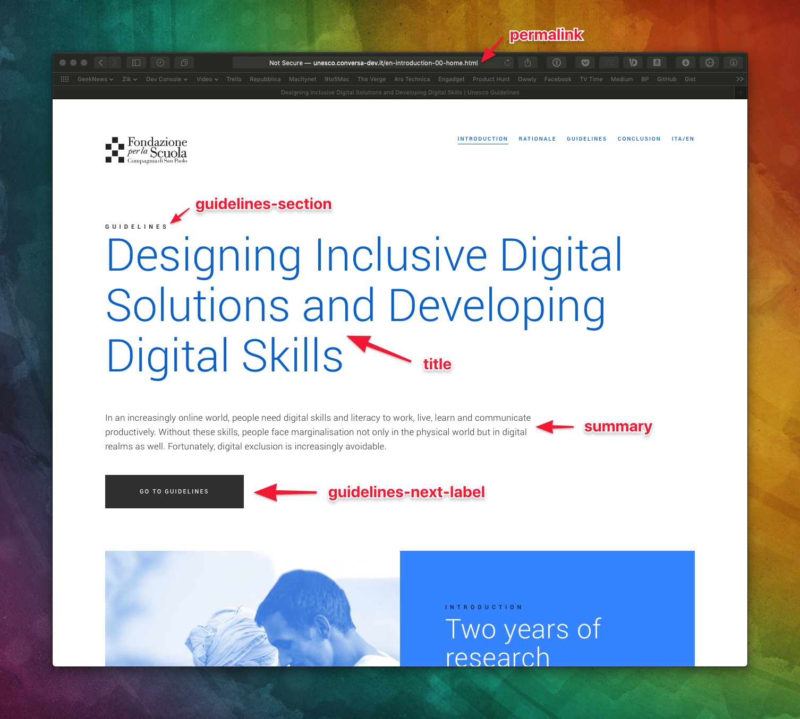
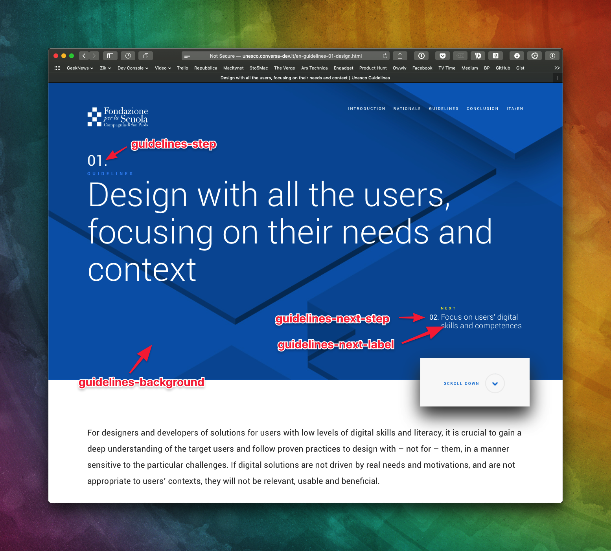
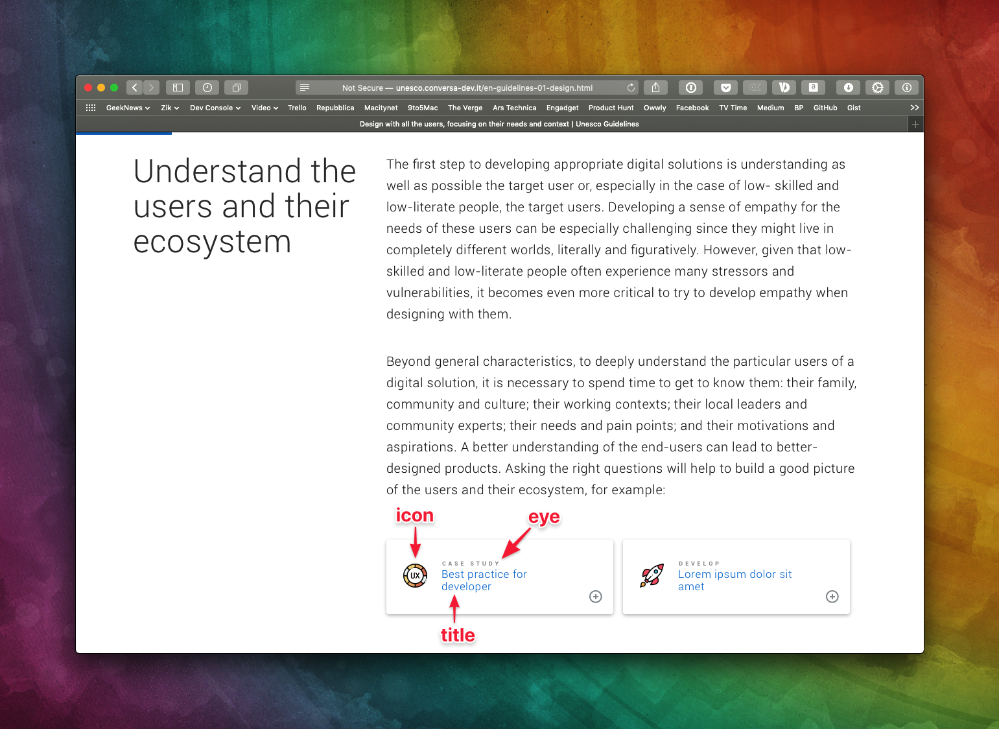
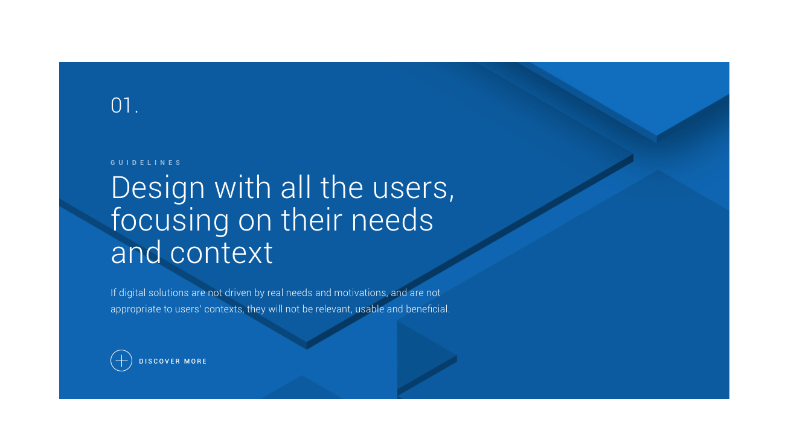
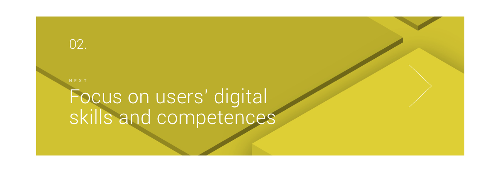
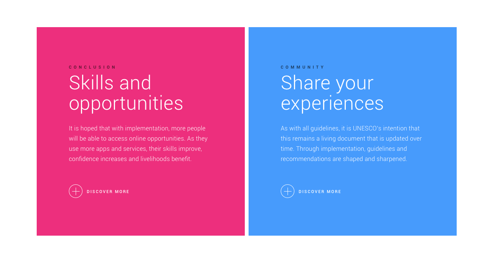
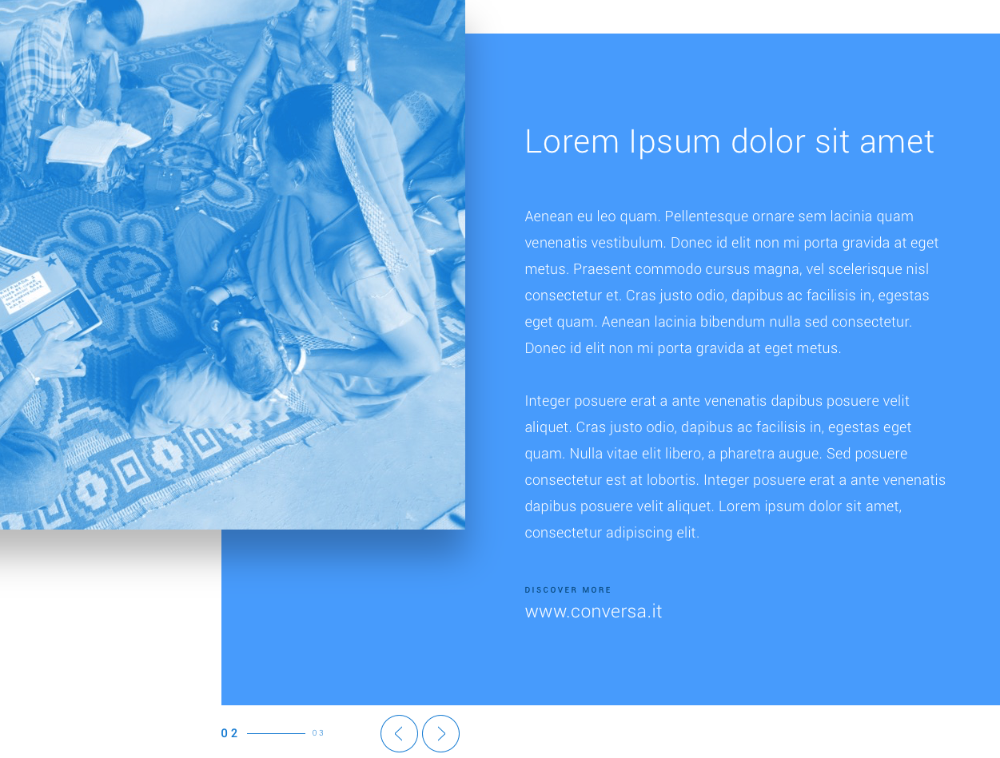

# Introduction

This is a toolkit to build a static, multi-language ***Guidelines for Digital Inclusion*** website using [Markdown](https://daringfireball.net/projects/markdown/).

The toolkit is built upon [Jekyll](https://github.com/jekyll/jekyll), a static website generator (think of it like a file-based CMS, without the complexity) using a fork of the [Jekyll Documentation Theme](https://idratherbewriting.com/documentation-theme-jekyll/index.html).


## Setup and build

Jekyll is based on Ruby and RubyGems, which are usually installed by default on Mac. If not, you can install it via brew. To install the jekyll gem itself, type:

```bash
sudo gem install jekyll bundler
```

To serve/preview the site locally, open a terminal window (use `Applications/Utilities/Terminal.app` on a Mac), `cd` to the root directory of the toolkit, then type:

```bash
jekyll serve
```

This will make it reachable from `http://localhost:4000`. You can also serve the site to a mobile device for testing purposes by using:

```bash
jekyll serve --host=0.0.0.0
```

This will make the site reachable from outside your computer: simply type the address on a browser on a device connected to the same Wi-Fi network on your computer type the above address (replace `localhost` with the IP address of your computer).
While the `jekyll serve` command is running, you can modify the site files and jekyll will continuosly rebuild the site on each file change, so you can simply reload a page in the browser to see the changes.

To build the site to `./_site` directory, type

```bash
jekyll build
```

Once built, you can upload the contents of the `./_site` directory to the production server using (S)FTP.


# Adding or modifying contents

Each page is built starting from a markdown file in the `/contents` directory. The tree structure of the folder is fixed and based upon the following structure:

```
- contents/
   - en/
      - pages/
         - section1/
            - page1.md
            - page2.md
         - section2/
            - page1.md
            - page2.md
   - it/
      - pages/
         - section1/
            - page1.md
            - page2.md
         - section2/
            - page1.md
            - page2.md

```

Thus, in the _contents_ directory you can find a folder for each language/localization, each containing a _pages_ folder containing your pages. You can actually use whatever folder structure inside the _pages_ directory, but our advice is to use a subfolder for each section and use the same file names for each page localization, as you can see in the example tree above.


## Images

All images must be placed inside the `/images` directory. When building the website, Jekyll will copy all images in the `/images` folder of the website, without recompressing them, so be sure to:

- Use only PNG and JPG images
- Check the file size
- Use unique names for the images


## Pages files (Markdown)

Each page content is built from a markdown (`.md`) file. [Markdown](https://daringfireball.net/projects/markdown/) is a lightweight markup language with plain text formatting syntax that you can modify using whatever text editor (e.g. Sublime Text or Visual Studio Code).

The markdown syntax is really easy to use and understand. The following is an example that will help you quick start with the syntax. For a complete guide, please refer to [this page](https://daringfireball.net/projects/markdown/syntax):

```md
# This is a section title

## This is a subsection title

This is normal paragraph text, also containing some _italic_ and **bold** text.

Here's how to create an unordered list:

- item 1
- item 2
- item 3

Here's how to create an ordered list:

1. Item 1
2. Item 2
3. Item 3

Here is an external link to the [Conversa](http://www.conversa.it) website and an internal link to [another page](en-introduction-00-home.html)

Here's how to add an image


```

You can also take a look to the already existing pages inside the _contents_ directory to see how they are built.


### Frontmatter

The frontmatter is an additional section included in each page markdown file, containing the page metadata.
This section is really important, since it allows to define the name of the page file in the built website, its title, but also its layout. There are two bundled layouts, _basic_ and _advanced_, each one with its own, specific frontmatter.


#### Basic Page Layout

The basic layout defines a page with one-column layout, without any heading image. This setup is used for sections introduction and homepages.
The frontmatter is defined as follows:

```yaml
---
permalink: en-introduction-00-home.html
guidelines-section: "guidelines"
title: Designing Inclusive Digital Solutions and Developing Digital Skills
summary: "In an increasingly online world, people need digital skills and literacy to work, live, learn and communicate productively. Without these skills, people face marginalisation not only in the physical world but in digital realms as well. Fortunately, digital exclusion is increasingly avoidable."
guidelines-next-label: "Go to Guidelines"
guidelines-next-link: en-guidelines-00-home.html
---
```

The following is a description of the basic metadata for the frontmatter:

- `permalink`: the name of the page file. This is very important since it will define the actual URL of the page, so **be sure to always use unique names**, otherwise one page will overwrite another.
- `guidelines-section`: defines the text that will appear above the page title in the page header
- `title`: the title of the page, will appear both in the page header and in the browser window
- `summary`: a summary of the topic of the page, will appear in the page header, just below the page title
- `guidelines-next-label` and `guidelines-next-link`: these are optionals. If specified, it define text and link of a button that will be placed right below the summary, in the page header

And here's an example of the resulting page layout:




#### Advanced Page Layout

The advanced layout defines a page with two-column layout, with a heading image and an optional _next step_ widget eventually to jump to the next step in the guideline. This setup is used for internal guidelines steps.

The frontmatter is defined as follows:

```yaml
---
permalink: en-guidelines-01-design.html
guidelines-section: "guidelines"
guidelines-background: "background-blue@2x.jpg"
title: Design with all the users, focusing on their needs and context
summary: "For designers and developers of solutions for users with low levels of digital skills and literacy, it is crucial to gain a deep understanding of the target users and follow proven practices to design with – not for – them, in a manner sensitive to the particular challenges. If digital solutions are not driven by real needs and motivations, and are not appropriate to users’ contexts, they will not be relevant, usable and beneficial."
guidelines-step: "01"
guidelines-next-step: "02"
guidelines-next-label: "Focus on users' digital skills and competences"
guidelines-next-link: en-guidelines-02-focus.html
---
```

As you can see, most of the metadata are the same ones of the basic layout, plus some additions:

- `guidelines-background`: the image to be used as heading background image. The presence of this metadata actually tells the toolkit to use the advanced layout
- `guidelines-step`: a number that defines the current step of the guideline, will be displayed above the page title
- `guidelines-next-step`, `guidelines-next-label` and `guidelines-next-link`: define the _next step_ header widget content and link

Here's an example of the resulting page layout:




### Widgets

The toolkit also offers some widgets that allow to easily add more structured contents to a page, such as graphically emphasized links to sections or resources and use cases slideshows.

These can be added to the content directly in the markdown files, using the code described for each one in the following sections.


#### Resource Box

The _resource box_ is a graphic box that allows to jump to internal or external resources linked to the content:



The code to create a _resource box_ is really simple and should be self-explaining:

```yaml

```


#### Link Box

The _link box_ is a block that allows to jump to another page or section inside the website. It is more prominent and complex compared to the resource box, allowing more content to be placed in and offering more customizations options.

Here's how a base _link box_ appears on the page:



And here's the code to obtain the above _link box_:

```yaml

```

A description of the various parameters follows. Notice that most of them are optionals and can be simply skipped if the corresponding functionality is not neeeded:

- `link`: internal page name or external address to link to
- `step`: optional step number, displayed on top of the block
- `eye`: optional eyelet, displayed above the title
- `title`: title for the _link box_
- `subtitle`: optional subtitle, displayed below the title
- `background-image`: optional image to be used as background
- `background-color`: optional background color. Predefined values are `blue` and `pink` but any valid CSS color can be used eventually

The _discover more_ button displayed below is automatically localized. There's also an alternative appearence using an arrow instead of the plus button:



To use it, just add the parameter `button-type="arrow"` to the definition, for example:

```yaml

```

Yet another variant of the _link box_ allows to add a photo to the box, which will be presented on the left (desktop) or on top (mobile) of the box:


To use it, just add the parameter `image` to the definition, with the file name of the image you want to use for example:

```yaml

```

Finally, you can use parameters `inline=1` and `inline=2` if you want two _link boxes_ to be displayed side by side.

Note that this configuration works only on pages using [basic layout](#basic-page-layout) and is not compatible with the `image` parameter described just above.



```yaml

```

#### Use Cases Slideshow

The _use cases slideshow_ allows to add a paginated and animated slideshow of use cases on the page. Each slideshow must have a unique `id` (containing only alphanumeric characters and underscore `_`) and one slide for each use case.

Each slide has the following mandatory parameters (where `<N>` is the actual number of the slide):

- `slide<N>_title`: the title of the use case
- `slide<N>_text`: the text of the use case
- `slide<N>_link`: the page file name or external link for the use case
- `slide<N>_image`: the file name of an image related to the use case

Here's an example of a slideshow with three use cases:

```yaml

```

And here's how it looks on the page:

